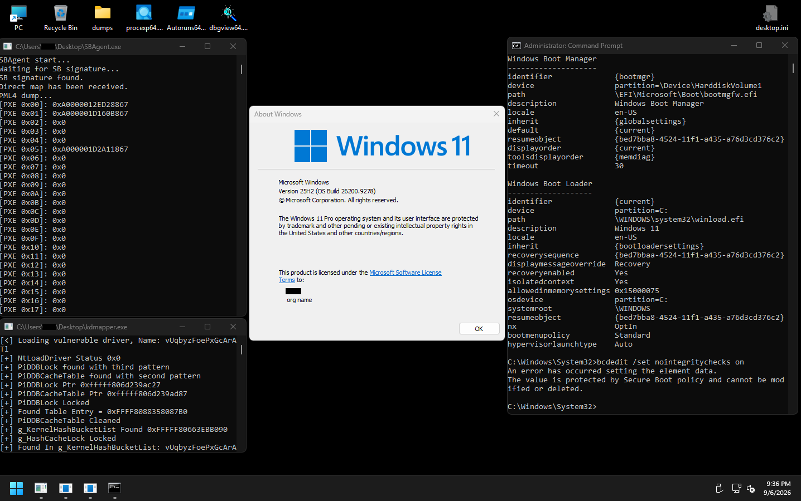

# SpaceBreacher - Bypassing UserSpace Isolation

SpaceBreacher is a proof-of-concept (PoC) that allows creating a user process with the ability to perform RWX operations on any hardware-accessible physical memory using a simple formula: PA + DirectMapBase. This makes it possible to completely bypass the user-process address space isolation and avoid any system APIs.

## Requirements

- The module must run in an environment where Virtualization-Based Security (VBS) is disabled.

- Under Secure Boot, the module must be loaded into the kernel via manual mapping.

## Tested Windows Builds

The latest successfully tested build:

- 26200.9278

## Test Images

## Authors

- [quokka867](https://github.com/quokka867)